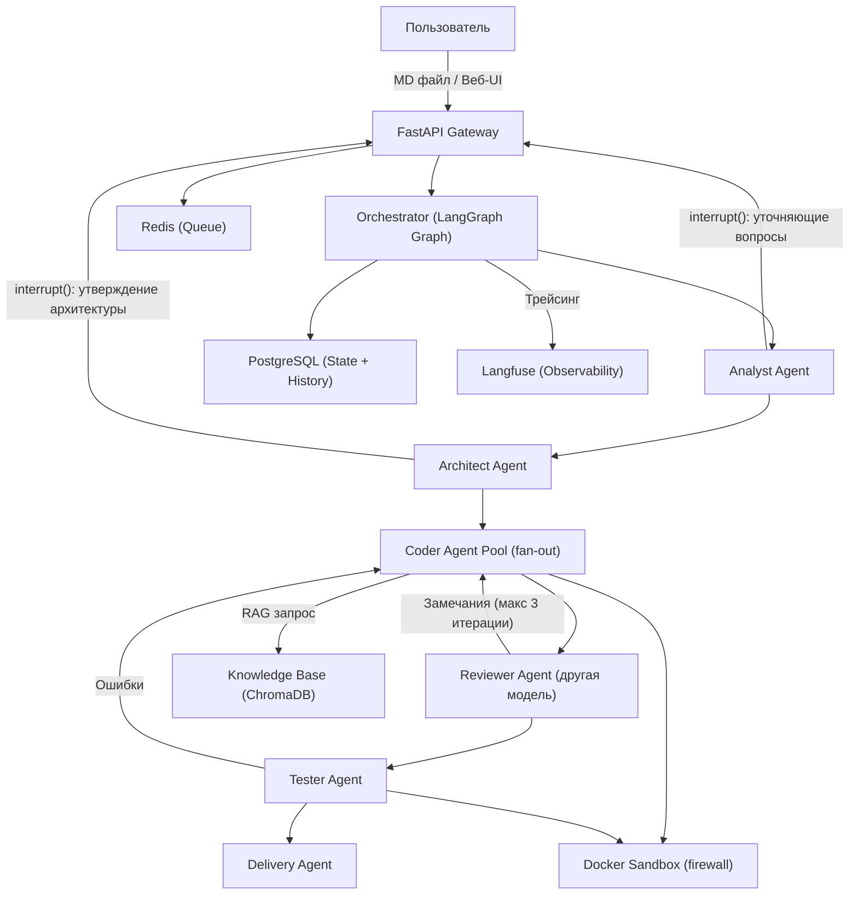
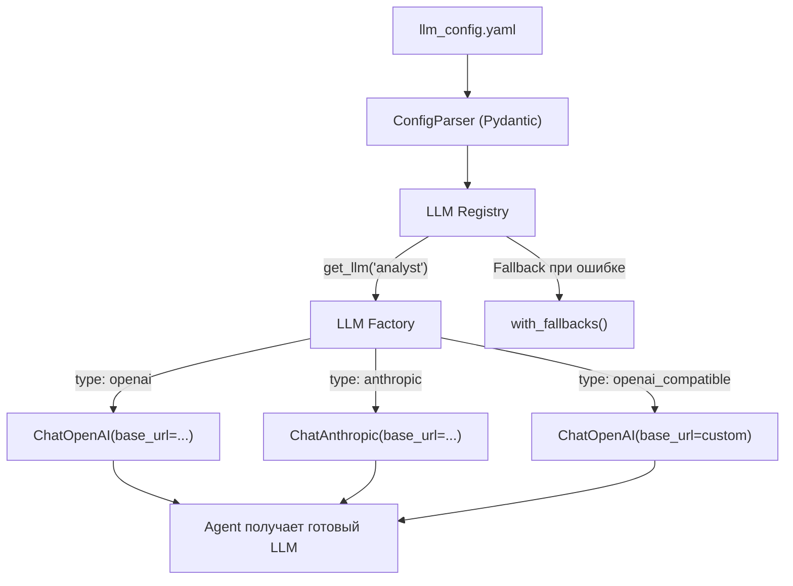
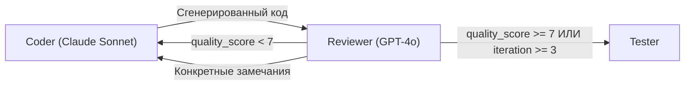
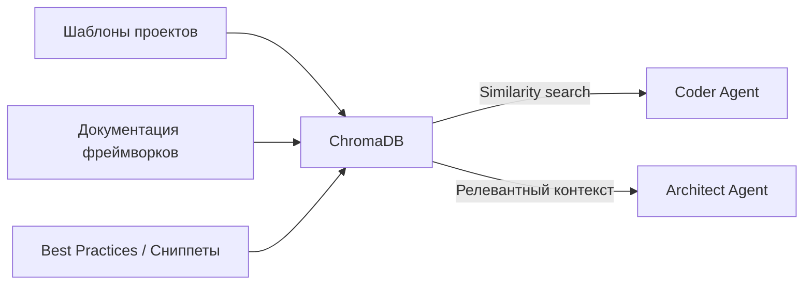
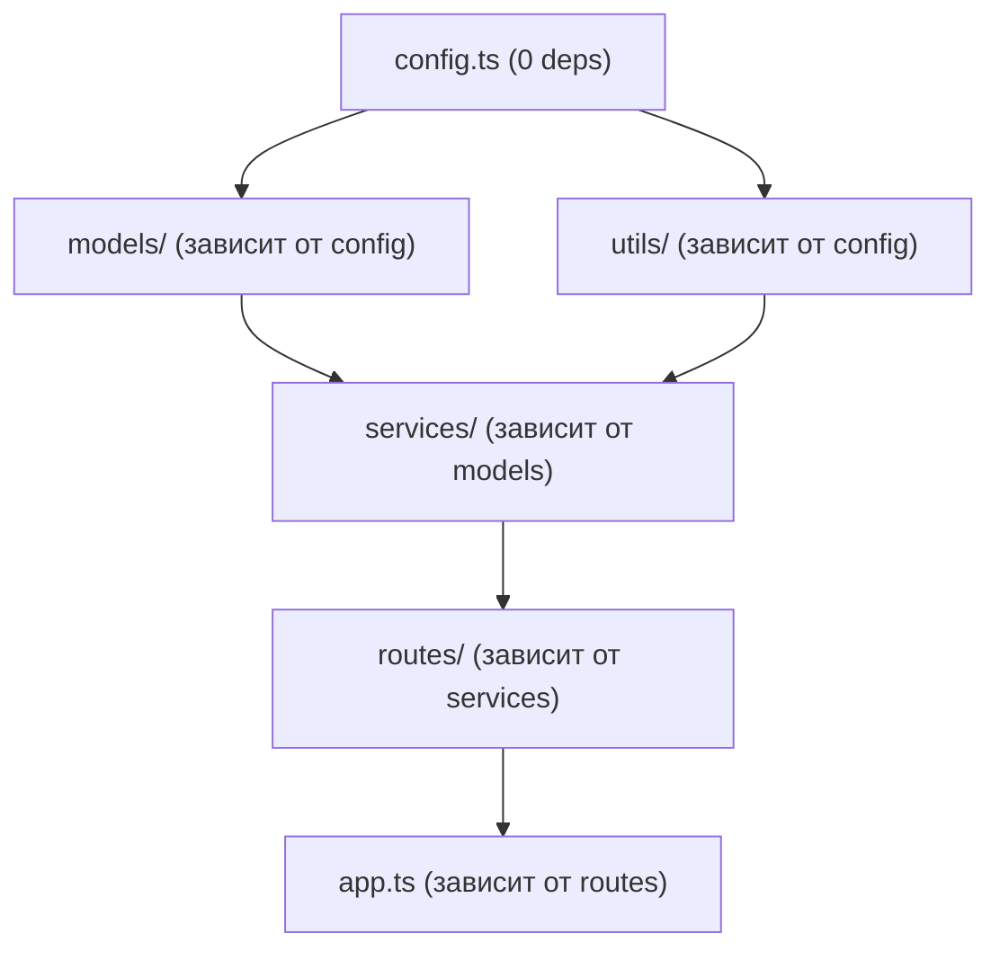
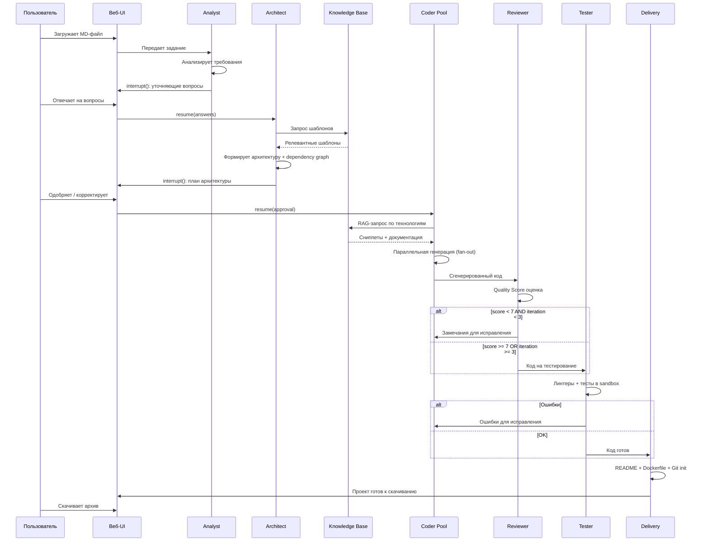
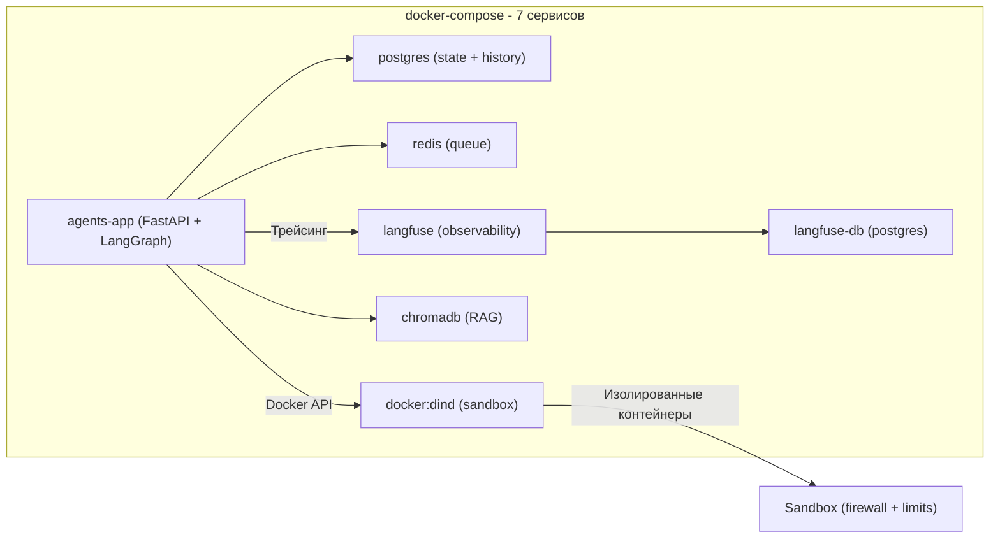

# Мультиагентная система генерации проектов (v2)

## Рекомендация по фреймворку: LangGraph

LangGraph -- лучший выбор для данной задачи по следующим причинам:

- **Stateful графы** -- каждый этап генерации проекта (анализ, уточнение, планирование, кодирование, ревью, тестирование) это узел графа с четким состоянием
- **Checkpointing** -- возобновление после сбоя, промежуточные результаты в PostgreSQL
- **interrupt()** -- нативный Human-in-the-Loop: остановка графа для уточняющих вопросов и утверждения архитектуры
- **Fan-out/Fan-in** -- параллельная генерация независимых файлов
- **Production-ready** -- используется LangChain, Daytona, Turing и другими крупными компаниями
- **Мультипровайдер** -- нативная поддержка OpenAI, Anthropic, Ollama через LangChain

## Архитектура системы




## Конфигурация LLM-провайдеров (llm_config.yaml)

Центральный YAML-конфиг, который определяет **все** LLM-провайдеры и привязку агентов к конкретным моделям. Поддерживает произвольные `base_url` для любых OpenAI-совместимых API (z.ai, MiniMax, Together, vLLM, Ollama, и т.д.).

**Файл:** `llm_config.yaml` (в корне проекта, маунтится в Docker)

```yaml
# === LLM Providers ===
# Каждый провайдер -- это именованный endpoint с base_url и api_key.
# api_key может ссылаться на env-переменную через ${ENV_VAR}

providers:
  openai:
    type: openai                          # openai | anthropic | openai_compatible
    base_url: "https://api.openai.com/v1"
    api_key: "${OPENAI_API_KEY}"
    
  anthropic:
    type: anthropic
    base_url: "https://api.anthropic.com"
    api_key: "${ANTHROPIC_API_KEY}"
    
  z_ai:
    type: openai_compatible               # Любой OpenAI-совместимый API
    base_url: "https://api.z.ai/v1"
    api_key: "${Z_AI_API_KEY}"
    
  minimax:
    type: openai_compatible
    base_url: "https://api.minimaxi.chat/v1"
    api_key: "${MINIMAX_API_KEY}"
    
  together:
    type: openai_compatible
    base_url: "https://api.together.xyz/v1"
    api_key: "${TOGETHER_API_KEY}"
    
  ollama_local:
    type: openai_compatible
    base_url: "http://ollama:11434/v1"
    api_key: "ollama"                     # Ollama не требует ключа
    
  vllm_local:
    type: openai_compatible
    base_url: "http://vllm:8000/v1"
    api_key: "none"

# === Agent -> Model Mapping ===
# Каждый агент привязан к конкретному провайдеру + модели.
# fallback -- резервная модель если основная недоступна.

agents:
  orchestrator:
    provider: openai
    model: "gpt-4o-mini"
    temperature: 0.0
    max_tokens: 2048
    fallback:
      provider: z_ai
      model: "gpt-4o-mini"
      
  analyst:
    provider: anthropic
    model: "claude-sonnet-4-20250514"
    temperature: 0.3
    max_tokens: 4096
    fallback:
      provider: openai
      model: "gpt-4o"
      
  architect:
    provider: anthropic
    model: "claude-sonnet-4-20250514"
    temperature: 0.2
    max_tokens: 8192
    fallback:
      provider: z_ai
      model: "claude-sonnet-4-20250514"
      
  coder:
    provider: anthropic
    model: "claude-sonnet-4-20250514"
    temperature: 0.1
    max_tokens: 16384
    fallback:
      provider: together
      model: "Qwen/Qwen2.5-Coder-32B-Instruct"
      
  reviewer:
    provider: openai                      # Намеренно другой провайдер/модель для Actor-Critic
    model: "gpt-4o"
    temperature: 0.2
    max_tokens: 4096
    fallback:
      provider: minimax
      model: "MiniMax-Text-01"
      
  tester:
    provider: openai
    model: "gpt-4o"
    temperature: 0.0
    max_tokens: 4096
    
  delivery:
    provider: anthropic
    model: "claude-sonnet-4-20250514"
    temperature: 0.2
    max_tokens: 8192

# === Embedding Model (для RAG) ===
embedding:
  provider: openai
  model: "text-embedding-3-small"
  fallback:
    provider: ollama_local
    model: "nomic-embed-text"

# === Global Defaults ===
defaults:
  timeout_seconds: 120
  max_retries: 3
  retry_delay_seconds: 5
```

### Архитектура LLM Registry




**Ключевые принципы:**

- Каждый агент вызывает `registry.get_llm("analyst")` и получает готовый LLM-объект с нужным `base_url`, `api_key`, `temperature`
- `type: openai_compatible` -- универсальный тип для **любого** OpenAI-совместимого API (z.ai, MiniMax, Together, vLLM, Ollama)
- `type: openai` и `type: anthropic` -- используют нативные LangChain-классы `ChatOpenAI` и `ChatAnthropic`
- Fallback через LangChain `with_fallbacks()` -- если основной провайдер вернул ошибку, автоматически переключается на резервный
- `api_key: "${ENV_VAR}"` -- ключи подставляются из переменных окружения, не хранятся в YAML
- Валидация конфига при старте приложения -- если провайдер недоступен, предупреждение в логах

**Файлы реализации:**

- `src/llm/__init__.py` -- экспорт registry
- `src/llm/registry.py` -- LLMRegistry: парсинг YAML, фабрика LLM, кеширование инстансов, fallback
- `src/llm/config_models.py` -- Pydantic-модели: ProviderConfig, AgentLLMConfig, EmbeddingConfig, LLMConfigFile
- `src/llm/factory.py` -- создание ChatOpenAI / ChatAnthropic / ChatOpenAI(base_url=custom) по type

**Пример использования в агенте:**

```python
from src.llm import registry

# В analyst.py
llm = registry.get_llm("analyst")  # Возвращает ChatAnthropic с fallback на ChatOpenAI
response = await llm.ainvoke(messages)

# В coder.py  
llm = registry.get_llm("coder")    # Возвращает ChatAnthropic с fallback на Together
```

**Смена модели для агента -- только правка YAML, без изменения кода:**

```yaml
# Было: Claude для кодера
coder:
  provider: anthropic
  model: "claude-sonnet-4-20250514"

# Стало: MiniMax для кодера
coder:
  provider: minimax
  model: "MiniMax-Text-01"
  temperature: 0.1
  max_tokens: 16384
```

## Агенты и их роли (8 агентов)

- **Orchestrator** -- управляет потоком графа, маршрутизация, interrupt-координация. LLM: настраивается в `llm_config.yaml` (по умолчанию GPT-4o-mini)
- **Analyst** -- парсит MD-файл, выявляет неясности, формирует уточняющие вопросы через `interrupt()`. LLM: настраивается в `llm_config.yaml` (по умолчанию Claude Sonnet)
- **Architect** -- определяет стек, структуру проекта, dependency graph файлов, зависимости. Результат утверждается пользователем через `interrupt()`. LLM: настраивается в `llm_config.yaml`
- **Coder** -- генерирует код с использованием RAG-контекста (шаблоны, документация). Работает параллельно по fan-out для независимых файлов. LLM: настраивается в `llm_config.yaml`
- **Reviewer** -- Self-Reflection на **другой модели** от Coder, оценивает quality score (0-10), конкретные критерии: корректность, безопасность, соответствие требованиям, code style. Максимум 3 итерации. LLM: настраивается в `llm_config.yaml`
- **Tester** -- запускает линтеры, тесты, проверяет сборку в Docker-песочнице. LLM: настраивается в `llm_config.yaml`
- **Knowledge Base** -- RAG-агент, подтягивает релевантные шаблоны, сниппеты и документацию из ChromaDB. Embedding model: настраивается в `llm_config.yaml`
- **Delivery** -- упаковывает проект, создает README, Dockerfile, docker-compose, инициализирует Git с осмысленными коммитами по этапам. LLM: настраивается в `llm_config.yaml`

## Ключевое улучшение: Self-Reflection Loop




Принцип Actor-Critic (как в Google Jules): Coder и Reviewer используют **разные модели** чтобы избежать agreeableness bias. Reviewer не исправляет код -- только критикует с конкретными замечаниями и quality score.

**Критерии выхода из цикла:**

- quality_score >= 7 (по шкале 0-10)
- ИЛИ достигнут лимит в 3 итерации
- ИЛИ все тесты/линтеры пройдены

## Ключевое улучшение: Human-in-the-Loop через interrupt()

LangGraph `interrupt()` используется в двух точках:

1. **После анализа MD** -- Analyst формирует список уточняющих вопросов, граф останавливается через `interrupt(questions)`, состояние сохраняется в PostgreSQL. Пользователь отвечает через WebSocket, граф возобновляется через `Command(resume=answers)`
2. **После планирования архитектуры** -- Architect формирует план (стек, файлы, зависимости), пользователь видит его в UI и может одобрить, скорректировать или задать вопросы. Только после одобрения начинается кодирование

## Ключевое улучшение: RAG Knowledge Base




**Источники знаний:**

- Шаблоны проектов: React + Vite, Next.js, FastAPI, Django, Express, NestJS, Go + Chi, и т.д.
- Документация: актуальные API фреймворков, best practices
- Сниппеты: аутентификация, работа с БД, Docker-конфигурации, CI/CD

**Как это работает:**

- При создании проекта Architect запрашивает из ChromaDB релевантные шаблоны по типу проекта
- Coder получает сниппеты и документацию по конкретным технологиям
- Это снижает галлюцинации API и повышает качество кода

## Ключевое улучшение: Параллельная генерация файлов

Architect создает **dependency graph файлов**:




LangGraph fan-out: файлы без взаимных зависимостей генерируются **параллельно** (config, utils -- одновременно), затем fan-in для зависимых файлов. Ускорение в 2-4 раза для крупных проектов.

## Ключевое улучшение: Observability (Langfuse)

- **Self-hosted** Langfuse в docker-compose (langfuse + langfuse-db)
- Автоматический трейсинг каждого LLM-вызова через LangChain callback
- Привязка трейсов к `task_id` -- можно посмотреть всю цепочку генерации конкретного проекта
- Метрики: стоимость токенов, латентность, количество итераций review, success rate
- Dashboard доступен по адресу `http://localhost:3001`

## Ключевое улучшение: Безопасность

- **Sandbox firewall** -- Docker-контейнеры с whitelist сети: только npm registry, PyPI, apt mirrors. Всё остальное заблокировано
- **Таймауты по этапам**: анализ (2 мин), архитектура (3 мин), генерация файла (5 мин), тестирование (10 мин), всего (30 мин)
- **Лимиты ресурсов**: CPU (2 cores), RAM (2GB), disk (1GB) на sandbox-контейнер
- **Rate limiting LLM**: максимум 100 вызовов на задачу, budget guard (макс. $5 на проект)
- **Максимальный размер проекта**: 50 файлов, 500KB общий размер кода

## Ключевое улучшение: Версионирование и история

- **Git в проекте**: Delivery Agent инициализирует Git, делает осмысленные коммиты по этапам ("feat: scaffold project structure", "feat: add API routes", "feat: add tests")
- **История генераций**: PostgreSQL таблица `generations` (task_id, md_content, architecture_plan, status, cost, duration, created_at)
- **Доработка проекта**: возможность загрузить ранее сгенерированный проект + новые требования в MD, система доработает существующий код

## Структура проекта

```
agents/
  docker-compose.yml              # 7 сервисов: app, postgres, redis, dind, chromadb, langfuse, langfuse-db
  Dockerfile                       # Образ для агентной системы
  llm_config.yaml                  # *** Конфигурация LLM-провайдеров и привязка агентов ***
  .env.example                     # API-ключи (OPENAI_API_KEY, ANTHROPIC_API_KEY, Z_AI_API_KEY, etc.)
  README.md                        # Документация
  requirements.txt                 # Python-зависимости

  src/
    main.py                        # Точка входа FastAPI
    config.py                      # Общая конфигурация: таймауты, лимиты, пути
    
    llm/                            # *** Модуль управления LLM-провайдерами ***
      __init__.py                  # Экспорт registry
      config_models.py             # Pydantic: ProviderConfig, AgentLLMConfig, LLMConfigFile
      factory.py                   # Фабрика: type -> ChatOpenAI / ChatAnthropic / ChatOpenAI(base_url)
      registry.py                  # LLMRegistry: get_llm("agent_name"), кеш, fallback, валидация
    
    agents/
      __init__.py
      orchestrator.py              # Главный LangGraph граф с interrupt() и fan-out
      analyst.py                   # Анализ задания + interrupt() для уточнений
      architect.py                 # Архитектура + dependency graph + interrupt() для утверждения
      coder.py                     # Генерация кода с RAG-контекстом
      reviewer.py                  # Self-Reflection: quality score, другая модель
      tester.py                    # Тестирование в песочнице
      delivery.py                  # Финальная сборка + Git init
    
    models/
      __init__.py
      state.py                     # ProjectState, QualityScore, DependencyGraph
      project.py                   # FileSpec, ProjectPlan, ArchitectureDecision
      messages.py                  # Question, Answer, ReviewFeedback
    
    sandbox/
      __init__.py
      docker_sandbox.py            # Управление контейнерами + firewall + лимиты
      executor.py                  # Выполнение команд + таймауты
      network.py                   # Сетевые ограничения (whitelist registries)
    
    knowledge_base/
      __init__.py
      rag.py                       # RAG: ChromaDB search, embedding, retrieval
      loader.py                    # Загрузка шаблонов и документации в ChromaDB
    
    observability/
      __init__.py
      tracing.py                   # Langfuse integration, callback handlers
      metrics.py                   # Метрики: стоимость, латентность, success rate
    
    security/
      __init__.py
      rate_limiter.py              # Rate limiting LLM вызовов
      budget_guard.py              # Контроль бюджета на задачу
      validators.py                # Валидация размера проекта, входных данных
    
    api/
      __init__.py
      routes.py                    # REST API: создать задачу, история, скачать проект
      websocket.py                 # WebSocket: чат, прогресс, interrupt-ответы
    
    prompts/
      analyst.md                   # Промпт для анализа задания
      architect.md                 # Промпт для архитектора
      coder.md                     # Промпт для кодера (с RAG-инструкциями)
      reviewer.md                  # Промпт для ревьюера (критерии quality score)
      delivery.md                  # Промпт для delivery (Git commit messages)
    
    web/
      index.html                   # SPA
      app.js                       # Фронтенд: чат, загрузка MD, утверждение архитектуры, история
      style.css                    # Стили

  templates/                        # Шаблоны проектов для RAG
    react-vite/
    fastapi/
    nextjs/
    django/
    express/

  tasks/                            # Папка для MD-файлов с заданиями
    example_task.md                # Пример задания

  output/                           # Сгенерированные проекты
```

## Технологический стек

- **Оркестрация**: LangGraph 0.4+ (stateful graph, interrupt(), fan-out/fan-in, checkpointing)
- **API**: FastAPI + WebSocket (real-time статус, interrupt-ответы)
- **LLM**: LangChain + LLM Registry (`llm_config.yaml`) -- мультипровайдер с произвольными base_url (OpenAI, Anthropic, z.ai, MiniMax, Together, Ollama, vLLM)
- **State**: PostgreSQL (checkpointing + история генераций) + Redis (очередь задач)
- **RAG**: ChromaDB (векторное хранилище) + OpenAI/local embeddings
- **Sandbox**: Docker-in-Docker (DinD) с firewall и ресурсными лимитами
- **Observability**: Langfuse (self-hosted, трейсинг, метрики, стоимость)
- **Frontend**: Vanilla JS -- чат, загрузка MD, утверждение архитектуры, прогресс по этапам, история

## Поток работы (User Flow)




## Docker-архитектура




## Ключевые архитектурные решения

- **Промпты в отдельных MD-файлах** -- легко итерировать без изменения кода
- **llm_config.yaml** -- единый YAML-конфиг для всех LLM: провайдеры с произвольным `base_url`, привязка агент->модель, fallback-цепочки, температура, токены. Смена модели -- правка одной строки в YAML без изменения кода
- **LLM Registry** -- фабрика `get_llm("agent_name")` возвращает готовый LLM-объект. Поддержка `openai`, `anthropic`, `openai_compatible` (z.ai, MiniMax, Together, vLLM, Ollama). Кеширование инстансов, автоматический fallback через `with_fallbacks()`
- **Actor-Critic паттерн** -- Coder и Reviewer настраиваются на разные провайдеры/модели через `llm_config.yaml` для объективного ревью
- **interrupt() для HITL** -- нативная остановка графа, состояние в PostgreSQL, возобновление через WebSocket
- **RAG из ChromaDB** -- шаблоны + документация снижают галлюцинации и повышают качество
- **Fan-out/Fan-in** -- параллельная генерация по dependency graph ускоряет работу в 2-4x
- **Langfuse self-hosted** -- полный контроль над данными, трейсинг каждого LLM-вызова
- **Budget guard** -- автоматическая остановка при превышении лимита стоимости
- **Git-версионирование** -- осмысленные коммиты по этапам в сгенерированном проекте
- **Docker-in-Docker с firewall** -- полная изоляция + whitelist только для package registries

